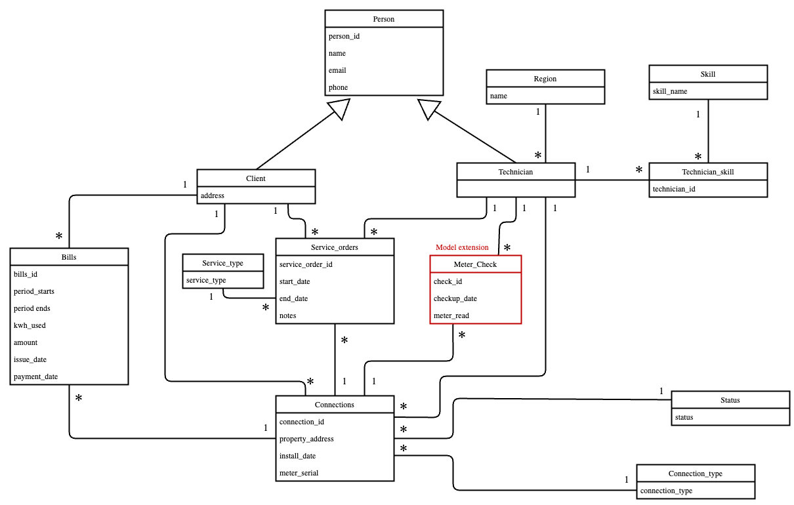

# Electrogrid Database Project 

## Table of Contents
- [About the Project](#about-the-project)
- [Project Structure](#project-structure)
- [Design Decisions](#design-decisions)
- [Data Loading](#data-loading)
- [User Interface](#user-interface-design)
- [Contributions](#team-contributions)


## About the Project
The goal of this project is to create a database for an electrical company that provides electricity distrubution and maintenace services to customers. 

We were provided the following csv files, which contains denormalized and redundant data:
- bills_raw.csv
- clients_raw.csv
- connections_raw.csv
- service_orders_raw.csv
- technicians_raw.csv

We followed the plan below for the completion of our project:

1. **Explore the dataset** to understand it's structure. 
2. **Develop a UML diagram** that depicts the entities, attributes and relationships describing the business model.
3. **Develop a relational model** for the UML diagram
4.  **Create the tables on the database** by creating a SQL script. 
5. **Load the data into the database** by creating a python script. 
6. **Create a simply user interface** to interact with the user by creating a python script. 

## Project Structure
```
Database_proj
├── raw_data/                     #datasets are stored
├── data_inspection.ipynb         #jupyter notebook used to explore dataset structure      
├── electrogid.sql                #Creates tables in database
├── load_electrogrid.py           #Loads data into database
├── electrogrid.py                #UI module to interact with user input       
├── relational.txt                #Relational Model as text file
├── uml.png                       #Image of UML Diagram
├── README.md                     #Project description
```

## Design Decisions

### 1. Normalization:

Our database follows Third Normal Form (3NF) principles.
Each table contains data related to a single entity (e.g., Client, Technician, Region, Connection, etc.).
Attributes in every table depend directly on the primary key, and not on any other column.

For example, in the Technician table, the region_name is linked through a foreign key to the Region table rather than being stored repeatedly in every technician record.

Similarly, the Client table only stores data specific to the client, while shared personal details (like name, email, and phone) are centralized in the Person table.

This design eliminates redundancy, ensures referential integrity, and makes updates and queries more efficient.


### 2. Model Extension: Meter_check

As an extension to our model we chose to create an additional table called "Meter_check" that keeps track of when a technician has checked the meter value for a client's connection. 


Below is our UML diagram integrating a new meter_check functionality:




## Data Loading

At the very top section of our python script (**load_electrogrid.py**), we set variables for the database credentials:

```
import pandas as pd
from pathlib import Path
import psycopg2
from psycopg2.extras import execute_values

#Configuration

PGHOST = "dbm.fe.up.pt"    
PGPORT = 5433
PGDATABASE = "fced01"
PGUSER = "fced01"               #Database username 
PGPASSWORD = "GROUP1"           #Database password  
PGSCHEMA = "electrogrid"        #Schema 

CSV_DIR = "./raw_data" 
```

In addition, we have also added the loading of the data for our **Meter_check** table in the load_electrogrid script:

```
# ------------------------------------Meter_Check-----------------------------------------#

meter_check_data = [
    ('CH001', 'MTR1000', 'T001', '2024-03-12', 'overload detected'),
    ('CH002', 'MTR1001', 'T002', '2024-07-28', '42 kwh'),
    ('CH003', 'MTR1002', 'T003', '2024-11-05', 'calibration needed'),
    ('CH004', 'MTR1003', 'T004', '2024-05-17', '57 kwh'),
    ('CH005', 'MTR1004', 'T005', '2024-09-14', 'display faulty'),
    ('CH006', 'MTR1005', 'T006', '2024-02-08', '23 kwh'),
    ('CH007', 'MTR1006', 'T007', '2024-12-30', 'communication error'),
    ('CH008', 'MTR1007', 'T008', '2024-06-21', '68 kwh'),
    ('CH009', 'MTR1008', 'T009', '2024-04-03', 'voltage spike'),
    ('CH010', 'MTR1009', 'T010', '2024-10-11', '19 kwh'),
    ('CH011', 'MTR1010', 'T011', '2024-08-25', 'meter replacement'),
    ('CH012', 'MTR1011', 'T012', '2024-01-15', '76 kwh'),
    ('CH013', 'MTR1012', 'T013', '2024-07-07', 'sensor failure'),
    ('CH014', 'MTR1013', 'T014', '2024-03-29', '34 kwh'),
    ('CH015', 'MTR1014', 'T015', '2024-12-12', 'battery low'),
    ('CH016', 'MTR1015', 'T016', '2024-05-05', '89 kwh'),
    ('CH017', 'MTR1016', 'T017', '2024-09-18', 'wiring issue'),
    ('CH018', 'MTR1017', 'T018', '2024-02-22', '12 kwh'),
    ('CH019', 'MTR1018', 'T019', '2024-11-08', 'reset required'),
    ('CH020', 'MTR1019', 'T020', '2024-06-14', '95 kwh')]
```

## User Interface Design

For our user interface section (**electrogrid.py**) we decided to create the following menu options:

1. Insert a new client
2. Search for a client information: Outputs client personal information, their active connections, and the service orders for those active connections
3. Search for a technician based on region selected
4. List all meter checks (most recent on top)
5. Exit 

## Team Contributions

### Julian:
- Design UML 
- Desing relational model and created the final relational.txt
- Wrote script for data cleaning for the following tables in load_electrogrid: "service_orders", "bills",
"connections", "technician_skill", "skills", and "technician".
- Developed the python script for the UI (electrogrid.py)
- Wrote README.md

### Kirill:
- Design UML and created final uml.png
- Incorporated the model extension "meter_check" into UML diagram 
- Wrote script for data cleaning and loading for the following tables in load_electrogrid: "client","person",
"service_type","status","connection_type","region", and "meter_check".
- Completed debugging for the load_electrogrid script 